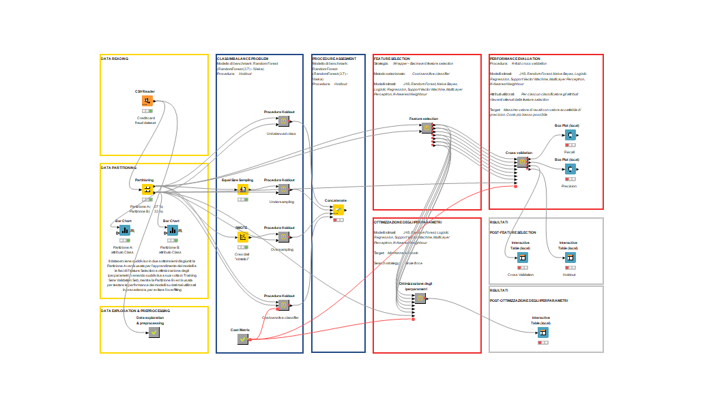

# Portfolio
---

## Machine Learning

### Predict Food Delivery Duration with Linear Regression, LASSO, and Random Forest using Python
An End-to-End Machine Learning Project for Predicting Food Delivery Duration in Python.

In this project, I am going to perform detailed data preprocessing on the food deliveries raw dataset provided by Doordash, then build classical machine learning models, including Linear Regression, cross-validated LASSO, and Random Forest to predict the food delivery durations using Python. 
   

---
## Causal Inference and Machine Learning

### Estimate the Effects of Oregon Health Insurance Expansion on Doctor Visits Using PDS Lasso and DML
An Causal Inference Project Using Machine Learning Augmented Regression Approach in Python

In this project, I estimate the causal effects of expanding access to Medicaid on the number of doctor visits using the cutting-edge machine learning augmented regression strategy, Post-double Selection Lasso (PDS Lasso) and Double/Debiased Machine Learning (DML), in addition to linear regression. As expected, I find the program statistically increases doctor visits later on at 1% level. Different models provide slightly different estimates.
   

 

---
## Experiments

### ???

The project consists in the application of <b>different classification models</b> to a dataset containing data relating to credit card transactions for the <b>detection of financial fraud</b>.
   
One of the most critical processes in finance is the <b>detection of fraudulent credit card transactions</b>. It is possible to detect these frauds with different machine learning algorithms, but what is the most effective <b>classifier</b> to accomplish this task?
 
In the first part of the project, we compared different techniques to counter the presence of unbalanced classes within the dataset. Then we compared the performance of some of the most widely used classification algorithms in this area. To determine the best method, we did not limit ourselves to the usual metrics but also took into account the costs to the financial institution related to any errors the model may make, a key aspect in this area.

 

 

---
## Causal Inference

### ??

Using <b>distibuctional semantics</b> (<b>word2vec</b> family algorithms and the <b>CADE</b> framework) to learn <b>word embeddings</b> from the <b>Italian</b> literary corpuses we generated.
   
The <b>goals</b> of our project were: 
 
<b>1.</b> to <b>obtain corpora</b> that were consistent with our research questions from a collection of texts obtained from two main sources 
 
<b>2.</b> to use distibutional semantics, and in particular algorithms from the word2vec family, along with the CADE framework, in order to learn <b>word embeddings</b> from the generated and processed corpora 
 
<b>3.</b> and finally to <b>analyze</b> some particularly <b>long-lived tòpos</b>, chosen arbitrarily, to be able to answer some research questions

 

 

---
## Data Visualization

### ??

---
## SQL

### ??

© 2022 Carbone Giorgio. Powered by Jekyll and the Minimal Theme.

