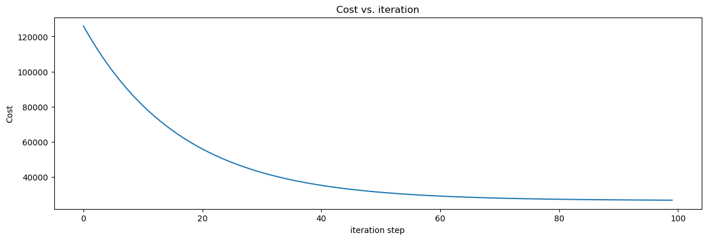
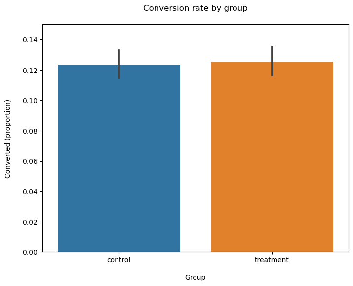

# Portfolio
---

## Machine Learning

### Deep Learning for Customer Churn Prediction using Tensorflow in Python
Three Neural Network Models with Different Complexity Levels Built and Evaluated 

The project demonstrates the practical application of deep learning (neural networks) using Tensorflow to predict customer churn in a real-world business scenario. The key aspects covered in this project include design, implementation, hyperparameter fine-tuning, model evaluation, and model selection.
   

---

### Predict Food Delivery Duration with Linear Regression, LASSO, and Random Forest using Python
An End-to-End Machine Learning Project for Predicting Food Delivery Duration in Python.

In this project, I am going to perform detailed data preprocessing on the food deliveries raw dataset provided by Doordash, then build classical machine learning models, including Linear Regression, cross-validated LASSO, and Random Forest to predict the food delivery durations using Python. 
   

---

### Predict Price with Gradient Descent Algorithm in Python
A Machine Learning Project Using the Gradient Descent Algorithm with Practical Implementation Steps Discussed in Details.

In this project, I delve into the dataset to predict price using linear regression with gradient descent and ordinary least squares. I then go beyond utilizing existing packages by manually implementing the gradient descent algorithm as well as discuss the impact of feature scaling and learning rate selection on convergence rate and prediction performance. 
   

---

## A/B Testing (Experimentation)

### New Product Page and Conversion Rate
A step-by-step analysis of an A/B test in Python from power analysis to hypothesis testing

This project utilizes an A/B test to determine whether the online e-commerce business should scale up a new version of the product page. Conversion rate is considered a good metric due to its measurability, sensitivity, and attributability. Four statistical tests, including the Two-sample T test, Two-sample proportion Z test, Chi-square test, and Bootstrapping, are employed. The results consistently suggest that one cannot reject the null hypothesis that the new page design does not affect the conversion rate.
   

---
## Causal Inference and Machine Learning

### Estimate the Effects of Oregon Health Insurance Expansion on Doctor Visits using PDS Lasso and DML
An Causal Inference Project Using Machine Learning Augmented Regression Approach in Python

In this project, I estimate the causal effects of expanding access to Medicaid on the number of doctor visits using the cutting-edge machine learning augmented regression strategy, Post-double Selection Lasso (PDS Lasso) and Double/Debiased Machine Learning (DML), in addition to linear regression. As expected, I find the program statistically increases doctor visits later on at 1% level. Different models provide slightly different estimates.
   

 

### Unveiling Heterogeneity: Exploring Treatment Effects with Random Causal Forest and EconML Python Libraries
An Empirical Project Assessing the Heterogeneous Treatment Effects of A Randomized Control Trial using Advanced Machine Learning Methods

In this project, to assess the heterogeneity, I build and interpret Random Causal Forest, a popular Machine Learning (ML) algorithm for Causal Inference, using the EconML Python libraries developed by Microsoft. Specifically, I first predict individual treatment effects based on the model. I then visualize the distribution of effects and assess the importance of various features. Lastly, I explore potential patterns of heterogeneity by analyzing the relationship between the most important features and the estimated treatment effects through scatterplots and linear regressions with interaction terms.
   

 

© 2023 Jiting Jiang. Powered by Jekyll and the Minimal Theme.

