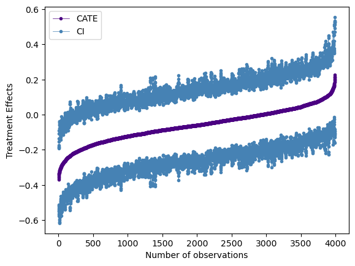

# Portfolio
---

## Machine Learning

### Predict Food Delivery Duration with Linear Regression, LASSO, and Random Forest using Python
An End-to-End Machine Learning Project for Predicting Food Delivery Duration in Python.

In this project, I am going to perform detailed data preprocessing on the food deliveries raw dataset provided by Doordash, then build classical machine learning models, including Linear Regression, cross-validated LASSO, and Random Forest to predict the food delivery durations using Python. 
   

---
## Causal Inference and Machine Learning

### Estimate the Effects of Oregon Health Insurance Expansion on Doctor Visits using PDS Lasso and DML
An Causal Inference Project Using Machine Learning Augmented Regression Approach in Python

In this project, I estimate the causal effects of expanding access to Medicaid on the number of doctor visits using the cutting-edge machine learning augmented regression strategy, Post-double Selection Lasso (PDS Lasso) and Double/Debiased Machine Learning (DML), in addition to linear regression. As expected, I find the program statistically increases doctor visits later on at 1% level. Different models provide slightly different estimates.
   

 

### Unveiling Heterogeneity: Exploring Treatment Effects with Random Causal Forest and EconML Python Libraries
An Causal Inference Project Assessing the Heterogeneous Treatment Effects using Random Causal Forest in Python

In this project, to assess the heterogeneity, I build and interpret Random Causal Forest, a popular Machine Learning (ML) algorithm for Causal Inference, using the EconML Python libraries developed by Microsoft. Specifically, I first predict individual treatment effects based on the model. I then visualize the distribution of effects and assess the importance of various features. Lastly, I explore potential patterns of heterogeneity by analyzing the relationship between the most important features and the estimated treatment effects.
   

 

© 2022 Carbone Giorgio. Powered by Jekyll and the Minimal Theme.

